# 万物之声 NatureSound Music

一款基于 HarmonyOS ArkTS 开发的音乐播放与非遗音乐内容应用。项目围绕“听见自然与传统文化之声”展开，融合在线音乐播放、歌词同步、歌单推荐、非遗地域音乐、互动社区、用户体系、主题换肤和本地持久化等能力，完整覆盖移动端音乐 App 的核心业务闭环。

> 适合作为 HarmonyOS / ArkTS / ArkUI 方向的课程设计、毕业设计、面试作品集项目展示。

## 版权与资源说明

本仓库仅用于 HarmonyOS / ArkTS / ArkUI 学习、课程设计、作品集展示和技术交流。

为避免版权风险，公开仓库不包含任何受版权保护的完整音频、歌词、专辑封面、歌手图片或第三方商业素材。

项目中的音乐数据、歌词数据和封面数据仅保留演示结构或占位示例。开发者如需运行完整播放效果，请自行导入已获得合法授权的音频、歌词和图片资源。

本项目不提供音乐资源下载服务，不用于商业运营。

## 项目亮点

- 完整音乐播放链路：基于 `AVPlayer` 封装播放器桥接层，支持播放、暂停、切歌、进度拖动、播放模式、播放列表维护。
- 后台音频体验：接入 `AVSession`，同步后台播放状态与媒体元数据，支持后台播放任务管理。
- 本地数据持久化：基于 HarmonyOS RDB 设计歌曲表，封装 Repository 层，支持种子数据初始化、搜索、收藏、增删改查。
- 歌词能力：支持 LRC 歌词解析、歌词字典映射和播放页歌词数据同步。
- 非遗音乐模块：按地域和音乐类型组织传统音乐内容，突出文化主题，不只是普通播放器壳。
- 用户与个性化：包含注册、登录、个人主页、换肤、设置中心、账号安全、播放下载偏好等页面。
- 工程化结构清晰：页面、模型、工具、资源、路由分层明确，便于继续扩展。
- 多端适配意识：面向 phone、tablet、2in1 设备配置，页面中包含基础屏幕宽度适配逻辑。

## 页面展示

截图已整理到 `docs/screenshots/` 目录，覆盖启动、首页、播放、歌单、非遗音乐、社区、用户体系、主题换肤、设置与系统媒体控制等关键页面。

<table>
  <tr>
    <td align="center">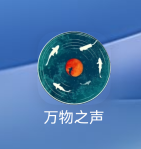<br>桌面图标</td>
    <td align="center">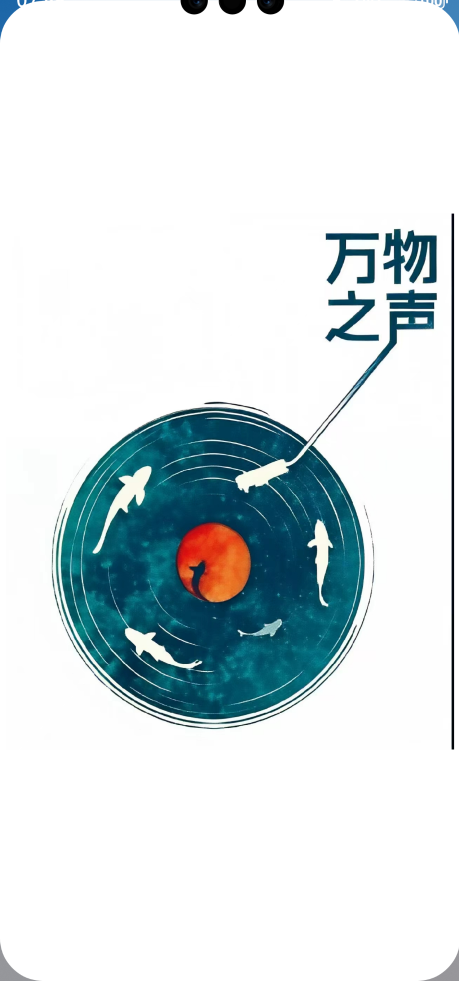<br>品牌启动页</td>
    <td align="center">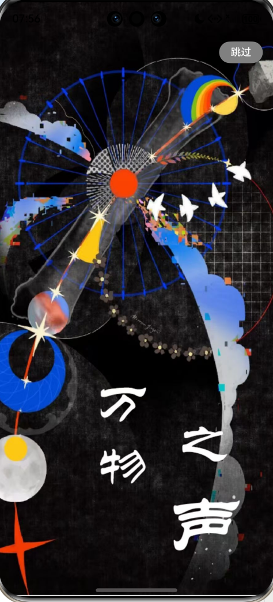<br>启动广告页</td>
    <td align="center"><br>首页推荐</td>
  </tr>
  <tr>
    <td align="center">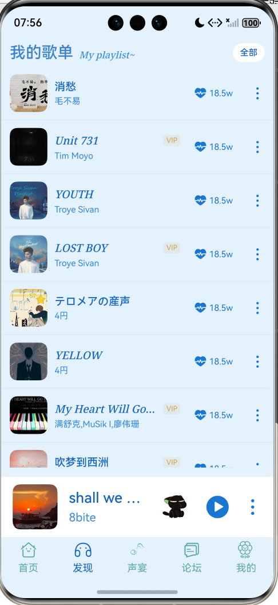<br>我的歌单</td>
    <td align="center">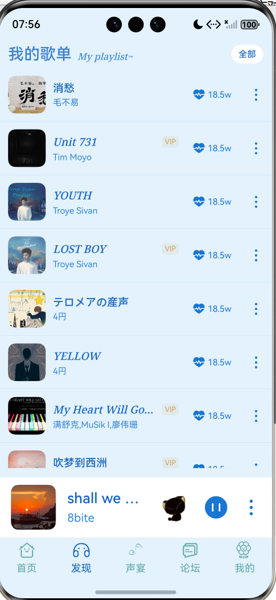<br>迷你播放器</td>
    <td align="center">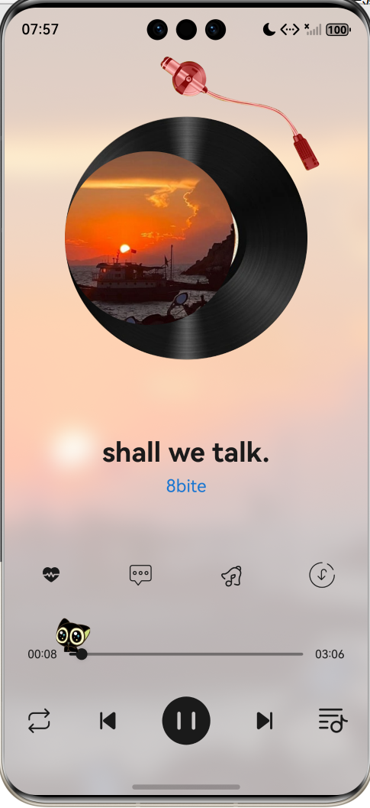<br>黑胶播放页</td>
    <td align="center">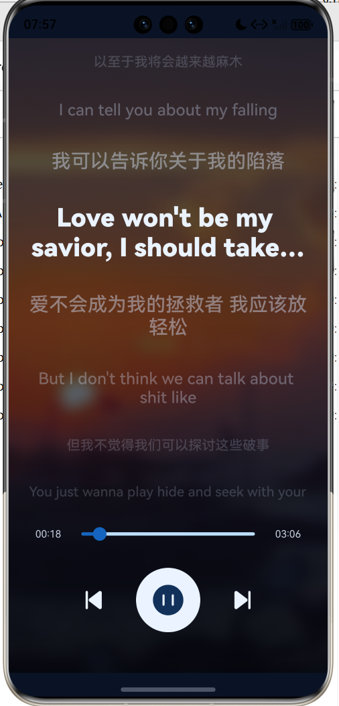<br>歌词同步页</td>
  </tr>
  <tr>
    <td align="center"><br>声宴非遗音乐</td>
    <td align="center"><br>互动广场</td>
    <td align="center">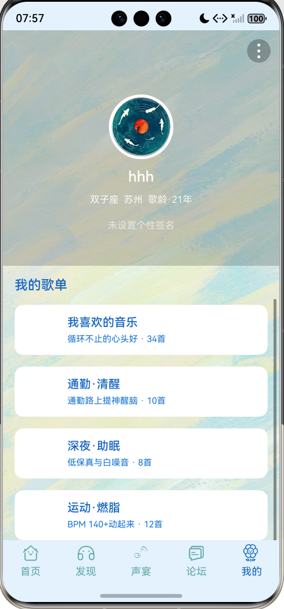<br>个人中心</td>
    <td align="center">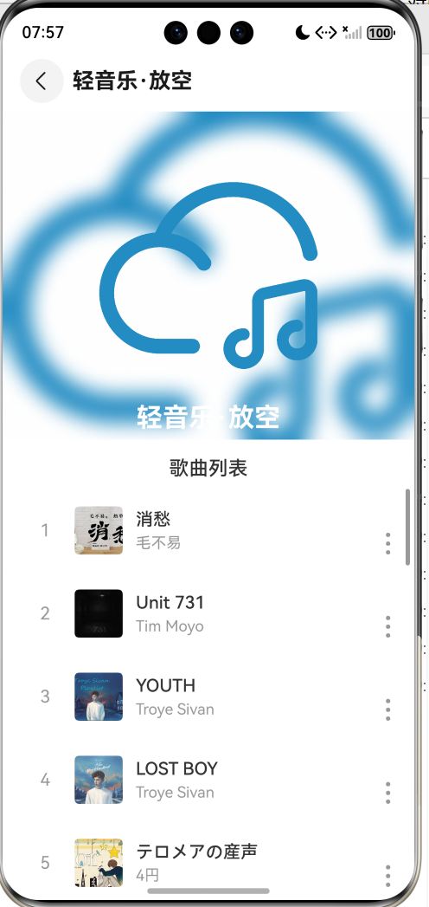<br>发现榜单</td>
  </tr>
  <tr>
    <td align="center">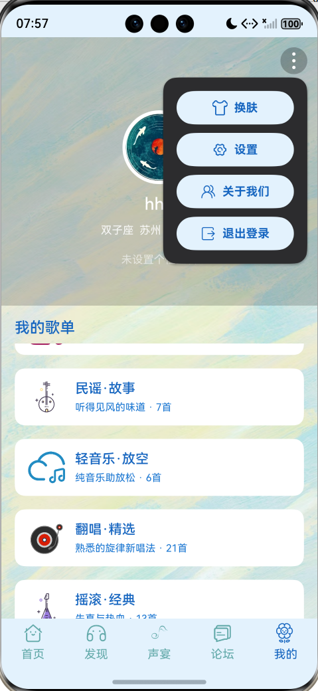<br>个人中心菜单</td>
    <td align="center">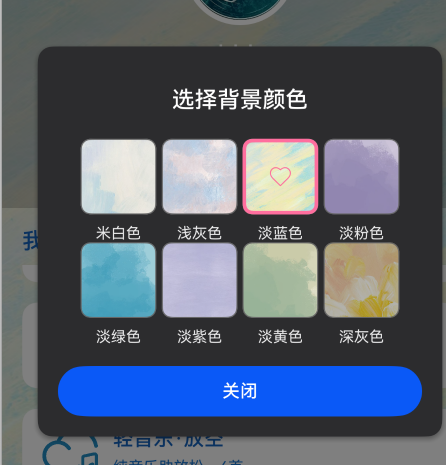<br>主题换肤</td>
    <td align="center">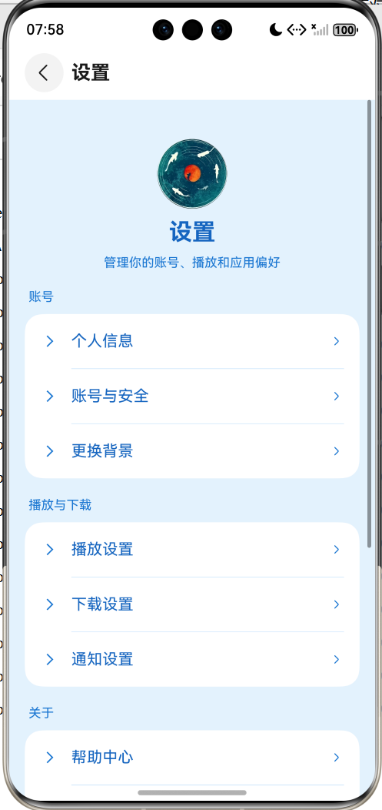<br>设置入口</td>
    <td align="center">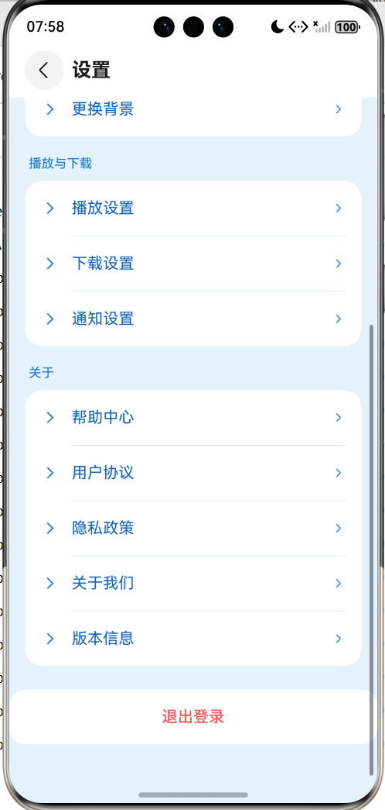<br>设置中心</td>
  </tr>
  <tr>
    <td align="center">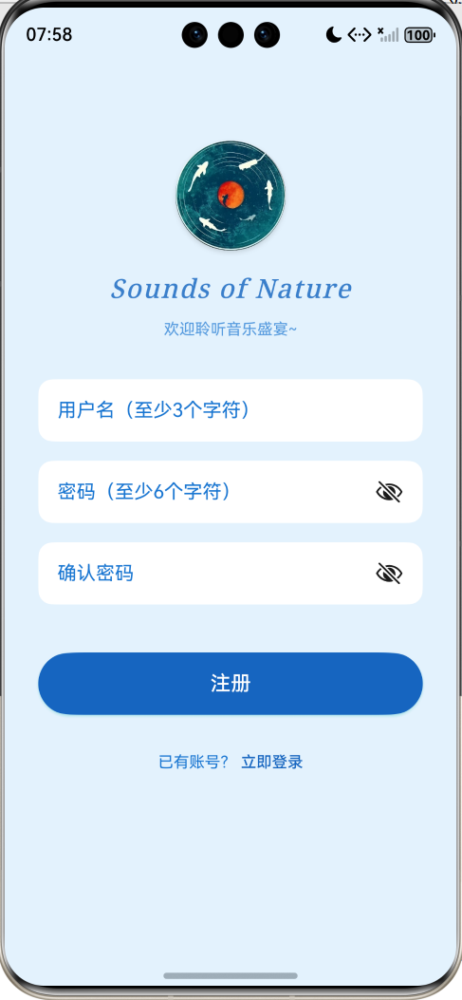<br>注册页面</td>
    <td align="center">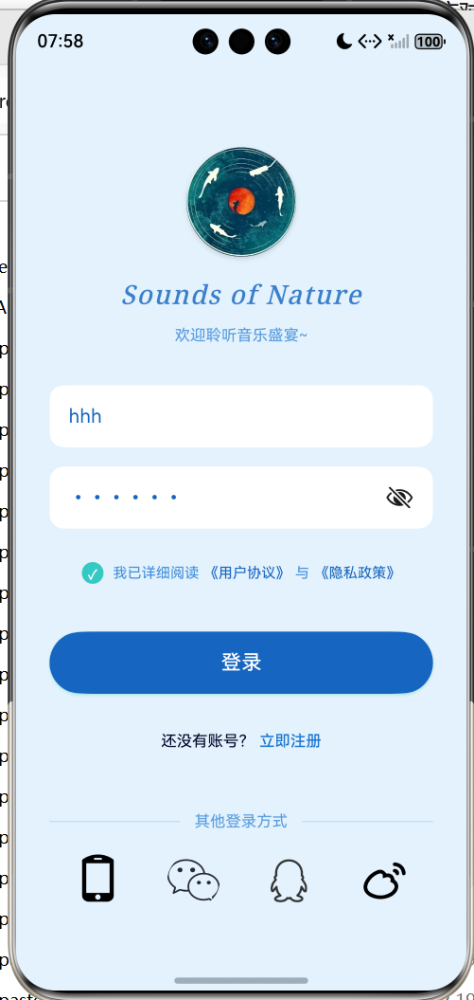<br>登录页面</td>
    <td align="center">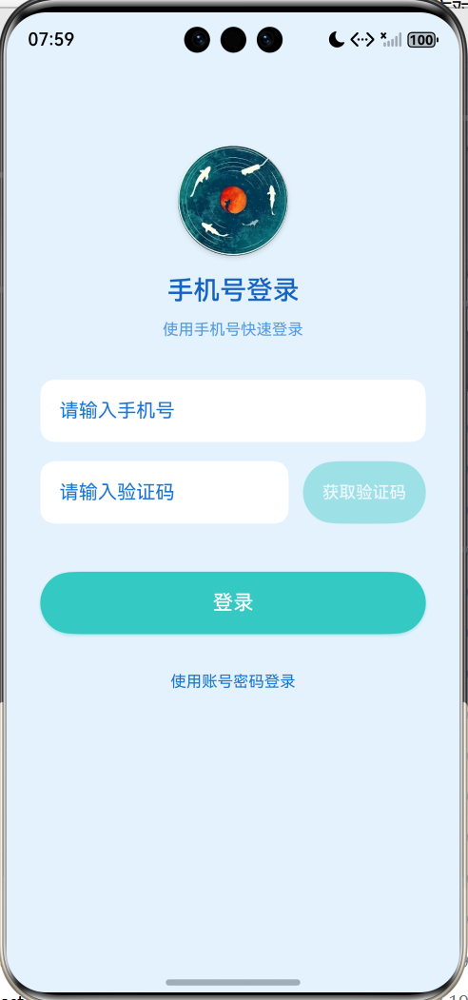<br>手机号登录</td>
    <td align="center">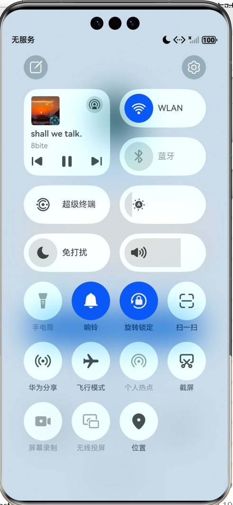<br>系统媒体控制</td>
  </tr>
</table>

## 功能模块

| 模块 | 说明 |
| --- | --- |
| 启动流程 | `Index` 初始化全局状态，进入 `Start` 启动页，再跳转主页面 |
| 首页推荐 | Banner、每日推荐、推荐歌单等音乐内容入口 |
| 音乐播放 | 播放页、黑胶视觉、进度条、收藏、评论入口、播放模式、播放列表 |
| 我的歌单 | 用户歌单、当前播放歌曲高亮、底部迷你播放器 |
| 声宴 | 长三角、粤港澳、成渝、长江中游等地域音乐内容 |
| 互动广场 | 用户动态、歌曲卡片、点赞评论分享入口 |
| 用户系统 | 注册、登录、协议勾选、第三方登录入口、个人资料展示 |
| 个性化 | 背景换肤、设置中心、播放下载、通知、账号安全、帮助与关于 |
| 数据管理 | RDB 数据库存储歌曲、收藏状态、种子数据与搜索结果 |
| 歌词系统 | 歌词字典、LRC 解析、播放状态联动 |

## 技术栈

- HarmonyOS 5.0.5
- ArkTS / ArkUI
- Stage 模型
- MediaKit `AVPlayer`
- AVSession
- RDB 关系型数据库
- AppStorageV2 状态管理
- Hvigor 构建系统
- Hypium 单元测试框架

## 项目文档

- [架构说明](docs/ARCHITECTURE.md)：工程分层、播放链路、数据持久化与非遗模块说明。
- [面试讲解稿](docs/INTERVIEW_GUIDE.md)：项目介绍、简历描述、高频问题回答方向。
- [项目说明书](docs/PROJECT_MANUAL.md)：项目背景、技术栈、核心模块、运行方式和讲解建议。
- [仓库发布清单](docs/REPOSITORY_CHECKLIST.md)：GitHub 发布前需要保留和排除的文件。
- [资源占位说明](docs/ASSETS_NOTICE.md)：公开仓库不包含完整版权素材的说明。
- [截图说明](docs/screenshots/README.md)：README 页面截图命名与维护规则。

## 技术实现

### 播放器封装

项目将底层 `AVPlayer` 操作集中封装在 `AvPlayerBridge` 中，对页面暴露更稳定的播放接口：

- `singPlay`：播放单曲并维护播放列表。
- `singPlayFromList`：从指定歌单播放。
- `changeSong`：切换歌曲并同步封面、歌词、时长和播放状态。
- `prevPlay` / `nextPlay`：支持顺序、随机、单曲循环等模式。
- `seekPlay`：进度跳转。
- 本地文件优先播放，异常时回退远程音频流。

### 数据持久化

`MusicDatabase` 负责创建 RDB 数据库和索引，`MusicRepository` 负责业务访问层封装：

- 数据库：`nature_sound_music.rdb`
- 数据表：`music_songs`
- 核心字段：`id`、`title`、`singer`、`url`、`cover`、`lyric`、`isFavorite`、`createTime`
- 能力：初始化种子数据、收藏切换、关键词搜索、数据同步、歌曲增删改查

### 路由与状态

项目使用 `Navigation`、`NavDestination` 和 `route_map.json` 管理页面路由，通过 `AppStorageV2` 共享导航栈、用户状态、主题状态和播放状态，减少页面之间的重复传参。

### 非遗音乐内容

`HeritageMusicData` 内置非遗音乐种子数据，`MusicFeast` 和 `HeritageRegionDetail` 负责展示地域化音乐内容，让项目具备明确的垂直主题和差异化表达。

## 目录结构

```text
NatureSound_Music/
├── AppScope/                         # 应用级配置、图标与启动资源
├── entry/
│   ├── src/main/ets/
│   │   ├── components/               # 通用组件
│   │   ├── entryability/             # 应用入口 Ability
│   │   ├── entrybackupability/       # 备份扩展 Ability
│   │   ├── models/                   # 用户、主题、音乐、社区等模型
│   │   ├── pages/                    # 页面实现
│   │   └── utils/                    # 播放、数据库、歌词、下载、屏幕适配工具
│   └── src/main/resources/
│       ├── base/element/             # 字符串、颜色、尺寸资源
│       ├── base/media/               # 图片、图标、动效资源
│       └── base/profile/             # 路由、页面、备份配置
├── docs/screenshots/                 # README 页面截图
├── lyrics_dict.json                  # demo 歌词字典结构
├── build-profile.json5               # 工程构建配置
└── oh-package.json5                  # 工程依赖配置
```

## 核心文件

| 文件 | 作用 |
| --- | --- |
| `entry/src/main/ets/pages/Index.ets` | 应用入口页面，初始化状态并进入启动页 |
| `entry/src/main/ets/pages/Layout.ets` | 主 Tab 框架：首页、发现、声宴、论坛、我的 |
| `entry/src/main/ets/pages/Play.ets` | 音乐播放页 |
| `entry/src/main/ets/pages/MusicFeast.ets` | 非遗音乐地域内容页 |
| `entry/src/main/ets/pages/Community.ets` | 互动广场 |
| `entry/src/main/ets/pages/Mine.ets` | 个人中心 |
| `entry/src/main/ets/utils/AvPlayerBridge.ets` | 播放器核心封装 |
| `entry/src/main/ets/utils/AvSessionManager.ets` | 后台播放会话管理 |
| `entry/src/main/ets/utils/MusicDatabase.ets` | RDB 数据库初始化 |
| `entry/src/main/ets/utils/MusicRepository.ets` | 歌曲数据访问层 |
| `entry/src/main/ets/utils/lyricsParser.ets` | LRC 歌词解析 |
| `entry/src/main/ets/utils/DownloadManager.ets` | 下载与离线播放管理 |

## 环境要求

- DevEco Studio
- HarmonyOS SDK 5.0.5 或兼容版本
- HarmonyOS 模拟器或真机
- 设备类型：phone、tablet、2in1

当前工程配置：

- Bundle Name：`com.xxfn.NatureSound_Music`
- Version：`5.0.0`
- Target SDK：`5.0.5(17)`
- Compatible SDK：`5.0.5(17)`

## 快速运行

1. 克隆项目：

```bash
git clone <your-repository-url>
cd NatureSound_Music
```

2. 使用 DevEco Studio 打开项目根目录。

3. 等待工程 Sync 完成。

4. 配置调试签名：

   在 DevEco Studio 中打开 `File > Project Structure > Signing Configs`，使用自己的 HarmonyOS 调试证书或自动签名配置。

5. 选择模拟器或真机，运行 `entry` 模块。

如果安装时报签名不一致，可以先卸载旧包：

```bash
hdc uninstall com.xxfn.NatureSound_Music
```

## 权限说明

| 权限 | 用途 |
| --- | --- |
| `ohos.permission.INTERNET` | 加载在线音乐、封面和网络内容 |
| `ohos.permission.KEEP_BACKGROUND_RUNNING` | 支持后台音频播放 |
| `ohos.permission.MICROPHONE` | 为音频相关能力预留 |
| `ohos.permission.READ_MEDIA` | 读取本地媒体文件 |
| `ohos.permission.WRITE_MEDIA` | 下载、缓存或写入媒体文件 |

> 基于 HarmonyOS ArkTS 独立开发音乐播放应用“万物之声”，实现在线音乐播放、后台播放、歌词解析、歌单推荐、非遗音乐内容展示、互动社区、用户登录注册、主题换肤和本地 RDB 数据持久化。项目封装 `AVPlayer` 播放器桥接层与 `MusicRepository` 数据访问层，支持播放状态同步、播放列表管理、收藏搜索、离线文件优先播放和远程流回退，具备较完整的移动端音乐 App 业务闭环。

## 后续优化方向

- 接入真实后端服务，实现用户、评论、动态和歌单云同步。
- 增加播放历史、最近常听、智能推荐和搜索热词。
- 完善下载队列、缓存大小统计和失败重试。
- 增加播放器状态、Repository、歌词解析的自动化测试。
- 增加深色模式、平板布局和无障碍适配。

## 许可证

本项目暂未声明开源许可证。若用于公开发布，请补充 `LICENSE` 文件，并确认图片、歌词、音频链接等资源的授权范围。
