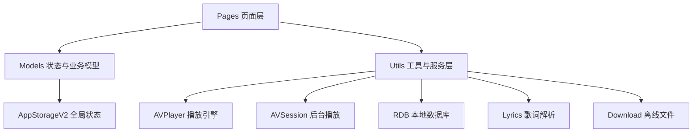

# Architecture

本文档用于说明“万物之声 NatureSound Music”的工程分层和核心技术实现，方便面试官快速理解项目不是简单页面堆叠，而是具备业务分层、状态管理和媒体播放封装的 HarmonyOS 应用。

## 总体架构

## 分层说明

| 层级 | 目录 | 说明 |
| --- | --- | --- |
| 页面层 | `entry/src/main/ets/pages` | 负责 UI 展示和用户交互，如首页、播放页、声宴、论坛、我的、设置等 |
| 组件层 | `entry/src/main/ets/components` | 放置可复用组件，如主题颜色选择器 |
| 模型层 | `entry/src/main/ets/models` | 定义用户、主题、音乐、社区、数据库实体等模型 |
| 服务层 | `entry/src/main/ets/utils` | 封装播放器、数据库、下载、歌词、屏幕适配、播放快照等能力 |
| 资源层 | `entry/src/main/resources` | 管理图片、图标、颜色、路由和页面配置 |

## 核心链路

### 1. 启动与导航

`Index.ets` 作为入口页面，初始化用户状态和主题状态，然后进入 `Start` 启动页。主页面由 `Layout.ets` 承载，通过底部 Tab 切换首页、发现、声宴、论坛和我的。

关键点：

- 使用 `Navigation` 与 `NavPathStack` 管理页面跳转。
- 使用 `route_map.json` 维护页面路由映射。
- 通过 `AppStorageV2` 共享导航栈、用户状态和主题状态。

### 2. 音乐播放

播放能力集中在 `AvPlayerBridge.ets` 中，页面无需直接操作 `AVPlayer`。

关键能力：

- 播放单曲和歌单。
- 上一首、下一首、暂停、进度跳转。
- 播放模式切换。
- 播放列表维护。
- 播放进度和状态快照保存。
- 本地下载文件优先播放，失败后回退远程音频流。

### 3. 后台播放

`AvSessionManager.ets` 负责音频会话和后台播放状态同步，让系统控制中心能够感知当前歌曲、播放状态和媒体元数据。

这部分体现了项目不只停留在页面层，而是考虑了移动端音乐应用真实使用场景。

### 4. 本地数据

`MusicDatabase.ets` 创建 RDB 数据库，`MusicRepository.ets` 提供统一数据访问接口。

数据表：`music_songs`

核心字段：

- `id`
- `title`
- `singer`
- `url`
- `cover`
- `lyric`
- `isFavorite`
- `createTime`

支持能力：

- 种子数据初始化。
- 歌曲搜索。
- 收藏切换。
- 歌曲增删改查。
- 历史种子数据对齐和脏数据清理。

### 5. 非遗音乐内容

`HeritageMusicData.ets` 和 `MusicFeast.ets` 组织非遗音乐地域内容，将长三角、粤港澳、成渝、长江中游、古风、现代音乐等内容板块结构化展示。

这是项目的差异化亮点：它不是普通音乐播放器模板，而是围绕“非遗音乐与自然声音”构建内容主题。

## 可扩展方向

- 接入真实后端 API，替换本地种子数据。
- 增加播放历史和个性化推荐。
- 将评论、动态和用户系统接入云端。
- 增加歌词逐字高亮、播放缓存清理和弱网重试。
- 为播放器、Repository、歌词解析补充自动化测试。
